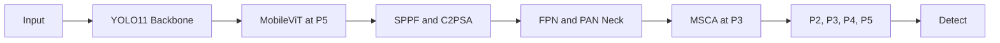

# Improved YOLO11 for Small Object Detection

An enhanced YOLO11 architecture for small-object detection in UAV imagery. It combines MobileViT global context, multi-scale convolutional attention, and a stride-4 P2 detection head for dense scenes, occlusion, and large scale variation.

## Architecture



- MobileViT combines depthwise-separable local features with Transformer token interactions at P5.
- MSCA refines P3 features through 3x3, 5x5, and 7x7 depthwise branches plus channel and spatial weighting.
- The P2 path merges the upsampled P3 feature with the backbone's stride-4 feature map.

## Model Variants

| Model | MobileViT | MSCA | P2 Head | Parameters | Detection Levels |
|---|---:|---:|---:|---:|---|
| YOLO11 | No | No | No | 9.432M | P3, P4, P5 |
| YOLO11-MobileViT | Yes | No | No | 10.634M | P3, P4, P5 |
| YOLO11-MSCA | No | Yes | No | 9.518M | P3, P4, P5 |
| YOLO11-MobileViT-MSCA | Yes | Yes | No | 10.720M | P3, P4, P5 |
| YOLO11-MobileViT-MSCA-P2 | Yes | Yes | Yes | 10.866M | P2, P3, P4, P5 |
| YOLO11-MobileViT-MSCA-P2 Edge | Yes | Yes | Yes | 2.999M | P2, P3, P4, P5 |

For a 320x320 input, the P2 model sends 80x80, 40x40, 20x20, and 10x10 feature maps to Detect. These correspond to strides 4, 8, 16, and 32.

## Installation

Python 3.10 or later is required.

```bash
git clone https://github.com/Zack-Zhang1031/yolo11-small-object-enhancement.git
cd yolo11-small-object-enhancement
python -m venv .venv
```

```bash
# Windows
.venv\Scripts\python -m pip install -e ".[dev]"

# Linux and macOS
.venv/bin/python -m pip install -e ".[dev]"
```

Install the export toolchain before creating ONNX artifacts:

```bash
python -m pip install -e ".[dev,export]"
```

## Quick Start

Build every model variant:

```bash
python scripts/build_all.py
```

Inspect the complete layer graph and Detect inputs:

```bash
python scripts/inspect_model.py mobilevit-msca-p2 --image-size 320
```

Run tensor inference with automatic stride-aligned padding:

```bash
python scripts/inference_demo.py
```

Run image inference with a checkpoint:

```bash
python scripts/inference_demo.py --source path/to/image.jpg --weights path/to/best.pt --device 0 --save
```

## Training

The project training entry point registers MobileViT and MSCA before Ultralytics parses the model graph:

```bash
python scripts/train.py \
  --model mobilevit-msca-p2 \
  --data configs/visdrone.yaml \
  --epochs 100 \
  --imgsz 640 \
  --batch 16 \
  --device 0
```

Use `--dry-run` to validate the model and arguments without starting a training job.

## VisDrone Comparison

The comparison runner trains YOLO11s, the enhanced model, YOLO12s, and RT-DETR-L with the same split, image size, epoch budget, seed, and validation settings. It writes normalized JSON and CSV reports containing mAP50-95, mAP50, mAP75, parameters, checkpoint size, and stage-level latency.

Download, convert, or verify the official dataset first:

```bash
python scripts/prepare_visdrone.py
```

Use `--check-only --data configs/visdrone.yaml` when the dataset already exists at the configured local path.

```bash
python scripts/compare_visdrone.py \
  --data configs/visdrone.yaml \
  --epochs 100 \
  --imgsz 640 \
  --batch 4 \
  --device 0
```

RT-DETR-L is intentionally included as an accuracy-oriented reference. Its released checkpoint uses 300 object queries, which is also the shared validation `max_det` value. YOLO12 is treated as a research benchmark because its attention-heavy design can consume more memory and provide lower CPU throughput than production-oriented YOLO variants.

Run `--dry-run` first to inspect the complete matrix without downloading comparison weights or starting training.

## Knowledge Distillation and Edge Export

Train the full enhanced model first, then use its best checkpoint as the teacher for the 2.999M-parameter edge student:

```bash
python scripts/train_distilled.py \
  --teacher runs/detect/yolo11-mobilevit-msca-p2/weights/best.pt \
  --data configs/visdrone.yaml \
  --student mobilevit-msca-p2-edge \
  --epochs 100 \
  --imgsz 640 \
  --batch 16 \
  --device 0
```

The pinned Ultralytics trainer performs score-weighted feature distillation. The student is initialized from compatible YOLO11n weights and keeps the stride-4 P2 head for small targets.

Export and verify numerical parity before device benchmarking:

```bash
python scripts/export_edge.py --weights path/to/best.pt --format onnx --imgsz 640
python scripts/verify_export.py --weights path/to/best.pt --export path/to/best.onnx --imgsz 640
python scripts/benchmark_edge.py --weights path/to/best.pt --data configs/visdrone.yaml --format onnx --device cpu
```

Use TensorRT FP16 for NVIDIA edge hardware or calibrated INT8 ONNX/OpenVINO for supported CPU and accelerator targets. INT8 export requires the dataset YAML through `--data`.

Training commands reject an explicit CUDA device when the active environment contains a CPU-only PyTorch build. This prevents an accidental CPU fallback from invalidating latency measurements or consuming days of training time.

## Python API

```python
import torch

from yolo11_small_object_enhancement import build_model, predict_tensor

model = build_model("mobilevit-msca-p2")
images = torch.rand(1, 3, 321, 511)
predictions, padding = predict_tensor(model, images)
```

`predict_tensor` pads non-aligned tensor inputs on the bottom and right. Pass `auto_pad=False` to enforce stride-aligned input dimensions.

## Validation

```bash
python -m ruff check src scripts tests
python -m mypy
python -m compileall src scripts tests -q
python -m pytest -q
python scripts/build_all.py
python scripts/smoke_test.py
python -m build --wheel
```

The test suite covers module gradients, invalid configurations, model construction, training-mode forward passes, rectangular inputs, automatic padding, bundled YAML resources, Ultralytics registration, distillation compatibility, comparison reports, and runtime P2/P3/P4/P5 feature scales.

GitHub Actions runs the checks on Windows and Linux with Python 3.10 and 3.12.

## Package Layout

```text
src/yolo11_small_object_enhancement/
|-- builder.py       model construction and tensor preprocessing
|-- training.py      Ultralytics integration
|-- cli.py           installed command-line entry points
|-- configs/         bundled model definitions
`-- modules/         MobileViT, MSCA, and shared layers
scripts/             repository command-line tools
tests/               unit, integration, and packaging tests
docs/                architecture and engineering notes
```

## License

This project is licensed under GNU AGPL-3.0-only to align with the default license of the Ultralytics dependency. Proprietary or closed-source commercial use may require an Ultralytics Enterprise License. Review the [Ultralytics licensing terms](https://www.ultralytics.com/license) for your use case.
